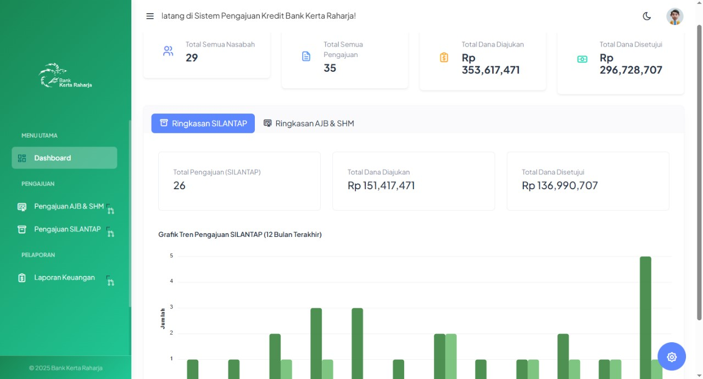

# Aplikasi Pengajuan Kredit - Dibangun dengan Laravel

<p align="center">
  
</p>

## 📄 Tentang Proyek
Aplikasi ini adalah sebuah sistem berbasis web yang dibangun menggunakan framework Laravel untuk mengelola proses pengajuan kredit secara digital. Pengguna dapat melakukan registrasi, login, dan mengajukan kredit melalui formulir yang tersedia. Admin memiliki akses ke dashboard khusus untuk memverifikasi dan mengelola status setiap pengajuan yang masuk.

Proyek ini dibuat sebagai implementasi praktis dari konsep **MVC (Model-View-Controller)**, sistem **otentikasi**, **autorisasi (roles)**, dan operasi **CRUD** dalam lingkungan pengembangan web modern.

---

## ✨ Fitur Utama
- **Otentikasi Pengguna:** Sistem login dan register yang aman untuk user dan admin.
- **Manajemen Role:** Perbedaan hak akses antara `admin` dan `user` biasa.
- **Form Pengajuan Dinamis:** Formulir lengkap bagi pengguna untuk menginput data pengajuan kredit.
- **Dashboard Admin:** Halaman khusus untuk admin melihat semua data pengajuan, dengan fitur untuk menyetujui atau menolak.
- **Dashboard User:** Halaman bagi pengguna untuk melihat riwayat dan status pengajuan kredit mereka.
- **Desain Responsif:** Tampilan yang nyaman diakses melalui desktop maupun perangkat mobile.

---

## 🛠️ Tumpukan Teknologi (Tech Stack)
- **Backend:** PHP 8, Laravel 10
- **Frontend:** Blade Templates, HTML5, CSS3, JavaScript
- **Database:** MySQL
- **Server Lokal:** XAMPP / Laragon
- **Dependency Manager:** Composer

---

## 🚀 Panduan Instalasi & Setup

Berikut adalah langkah-langkah untuk menjalankan proyek ini di lingkungan lokalmu.

1.  **Clone repository ini:**
    ```bash
    git clone [https://github.com/ch3mod/Laravel-PengajuanKredit.git](https://github.com/ch3mod/Laravel-PengajuanKredit.git)
    ```

2.  **Masuk ke direktori proyek:**
    ```bash
    cd Laravel-PengajuanKredit
    ```

3.  **Install semua dependency PHP:**
    ```bash
    composer install
    ```

4.  **Copy file environment:**
    Salin file `.env.example` menjadi file `.env` baru.
    ```bash
    cp .env.example .env
    ```

5.  **Generate application key unik:**
    ```bash
    php artisan key:generate
    ```

6.  **Konfigurasi Database:**
    - Buka file `.env` menggunakan code editor.
    - Buat sebuah database baru di phpMyAdmin / Navicat (misalnya dengan nama `pengajuan_kredit`).
    - Atur konfigurasi database di file `.env` sesuai dengan settingan lokalmu:
      ```env
      DB_CONNECTION=mysql
      DB_HOST=127.0.0.1
      DB_PORT=3306
      DB_DATABASE=pengajuan_kredit  // <-- Ganti dengan nama database-mu
      DB_USERNAME=root              // <-- Ganti dengan username database-mu
      DB_PASSWORD=                  // <-- Ganti dengan password database-mu (kosongkan jika tidak ada)
      ```

7.  **Jalankan Migrasi & Seeder Database:**
    Perintah ini akan membuat semua tabel yang dibutuhkan dan mengisi beberapa data awal (jika seeder sudah dibuat).
    ```bash
    php artisan migrate --seed
    ```

8.  **Jalankan server pengembangan lokal:**
    ```bash
    php artisan serve
    ```

9. **Selesai!** Aplikasi sekarang berjalan dan bisa diakses di **http://127.0.0.1:8000**.
